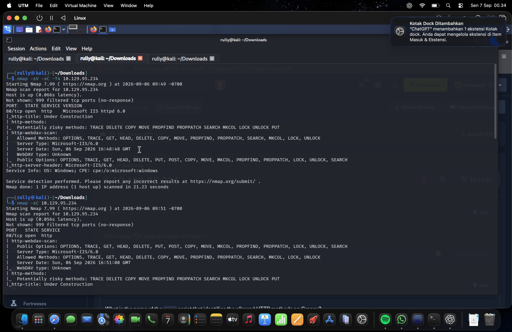
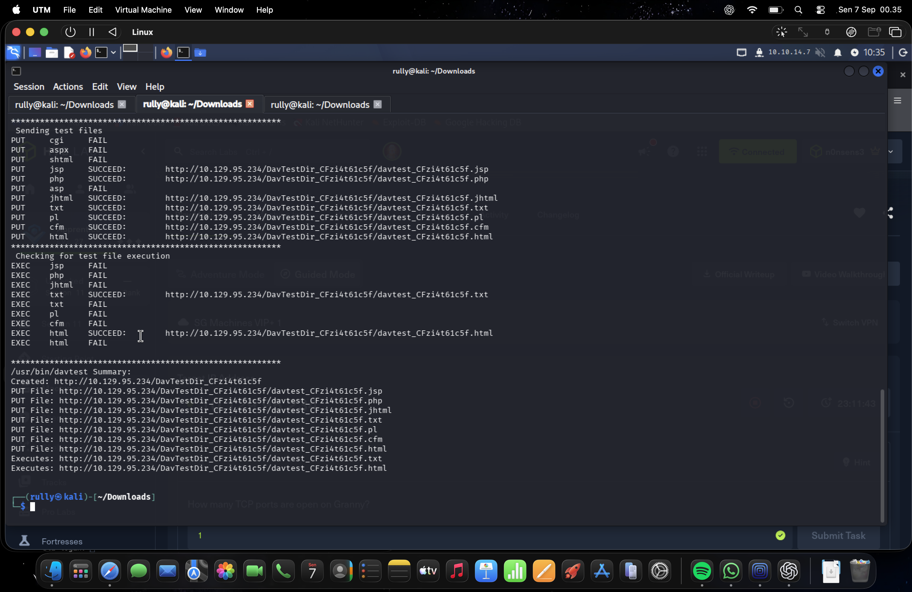
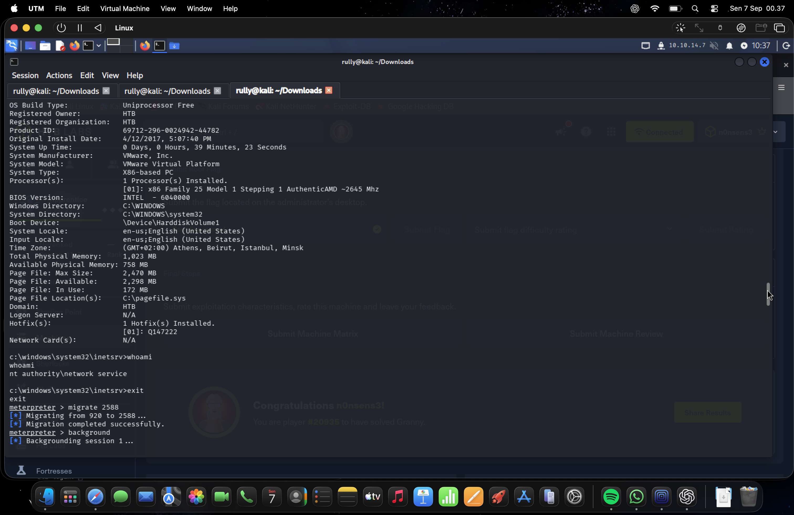
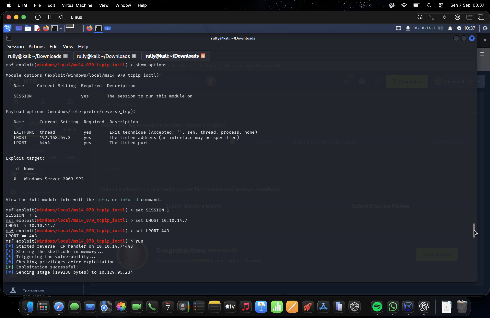
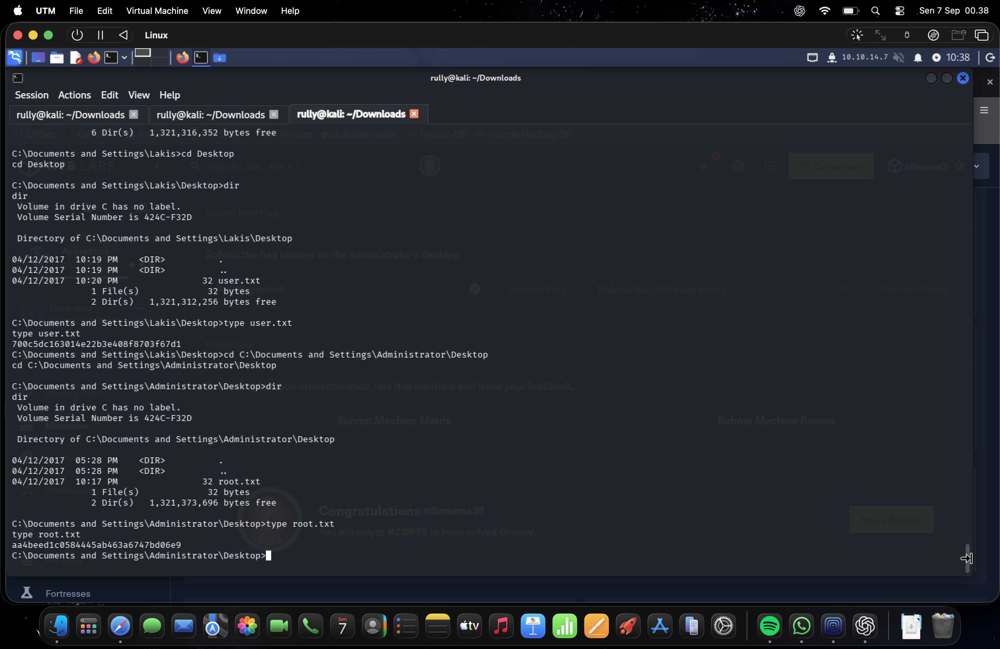

# Hack The Box — Granny CTF Report

| Item | Details |
| --- | --- |
| Platform | Hack The Box |
| Machine | Granny |
| Target IP recorded in the evidence | `10.129.95.234` |
| Target hostname | `GRANNY` |
| Operating system | Windows Server 2003 Standard Edition, Service Pack 2, x86 |
| Exposed service observed | HTTP on TCP port 80 — Microsoft IIS 6.0 |
| Report date | 7 September 2026 |
| Evidence | 15 supplied screenshots, numbered S01–S15 |
| Outcome | User and administrator/root flags retrieved |

## 1. Executive Summary

The supplied screenshots document completion of the Hack The Box machine **Granny**. Network enumeration identified an IIS 6.0 web server with WebDAV enabled. Subsequent testing demonstrated that the server accepted several file types through WebDAV, although these upload results did not establish server-side script execution.

The recorded initial access used an IIS WebDAV vulnerability associated with **CVE-2017-7269** and produced a Meterpreter session. A Windows shell later identified the initial execution context as `NT AUTHORITY\NETWORK SERVICE`.

Local assessment identified possible privilege escalation vulnerabilities. An MS16-016 attempt is visible, but its final outcome is not shown. A subsequent attempt associated with **MS14-070** reported successful exploitation and opened a second session. The final screenshot shows both `user.txt` and `root.txt` being read from the relevant desktop directories.

The evidence supports successful completion of both flag objectives. It does not include a post-escalation identity check, so the exact account associated with the final session is not independently established.

## 2. Scope and Evidence Basis

This report reconstructs the activity shown in the supplied screenshots. No target interaction was performed while preparing it. Terminal output provides the primary evidence; the Hack The Box page visible behind the terminal provides supporting context.

The assessment shown concerns the single lab target `10.129.95.234`. Kali Linux was used within a UTM virtual machine on macOS. The screenshots show Nmap 7.99, Gobuster 3.8.2, DAVTest, and Metasploit Framework 6.4.135-dev.

The screenshot filenames are dated **7 September 2026**, while some terminal events are dated **6 September 2026** with an explicit `-0700` offset. Capture order is used to organize the evidence; the screenshots are not treated as a synchronized timeline or a complete activity log.

External references are used only to clarify vulnerability identifiers and platform support status. Links appear beside the relevant statements. Original screenshots are preserved in the accompanying `evidence` folder, with a complete index in Section 10.

## 3. Reconnaissance and Web Enumeration

### 3.1 Network and service discovery

**Evidence: S01**

Two Nmap results identified the host as reachable. The visible scan output contained the following findings:

| Observation | Recorded result |
| --- | --- |
| Open TCP port | `80/tcp` |
| Service | HTTP |
| Server version | Microsoft IIS HTTP server 6.0 |
| HTTP server header | `Microsoft-IIS/6.0` |
| Page title | `Under Construction` |
| Other scanned ports | 999 filtered, with no response |
| OS indication | Windows |

**One open TCP port was observed among the 1,000 ports covered by the displayed scans.** The screenshots do not show a full TCP port-range scan or a UDP scan.

The `http-methods` and `http-webdav-scan` results reported WebDAV-related methods, including `PROPFIND`, `PROPPATCH`, `MKCOL`, `COPY`, `MOVE`, `LOCK`, and `UNLOCK`. Other reported methods included `PUT` and `DELETE`.

These results identified a web authoring interface for further assessment. An advertised HTTP method alone does not prove that every operation is permitted; the subsequent DAVTest output supplies evidence of actual write behavior.

### 3.2 Directory enumeration

**Evidence: S02**

Gobuster completed a directory enumeration run using the DIRB common wordlist, with 4,613 of 4,613 entries processed. The following paths were visible:

| Path | HTTP status |
| --- | --- |
| `/_private` | 301 |
| `/_vti_bin` | 301 |
| `/_vti_log` | 301 |
| `/_vti_bin/shtml.dll` | 200 |
| `/_vti_bin/_vti_adm/admin.dll` | 200 |
| `/_vti_bin/_vti_aut/author.dll` | 200 |
| `/aspnet_client` | 301 |
| `/Images` | 301 |
| `/images` | 301 |

The path names are consistent with legacy Microsoft web components. However, directory names and HTTP 200 responses do not establish a separate vulnerability in each component. The case variants `/Images` and `/images` also do not establish two distinct directories.

### 3.3 WebDAV behavior

**Evidence: S02–S03**

DAVTest successfully connected to the server, created a test directory, and reported the following upload results:

| Result | File extensions |
| --- | --- |
| Upload succeeded | `.jsp`, `.php`, `.jhtml`, `.txt`, `.pl`, `.cfm`, `.html` |
| Upload failed | `.cgi`, `.aspx`, `.shtml`, `.asp` |

The displayed invocation contains no supplied username or password. The results therefore support WebDAV write access without explicitly supplied credentials in this test.

DAVTest's final summary listed `.txt` and `.html` under its execution results. The intermediate output also contained repeated success/failure lines for those extensions. The conservative interpretation is that uploaded static content was accessible; the screenshots do not demonstrate successful server-side execution of an uploaded script. Uploads of `.php` or `.jsp` files are not, by themselves, evidence that their contents executed.

## 4. Initial Access

**Evidence: S04–S07**

The terminal history shows investigation of **CVE-2017-7269**, followed by selection and execution of an IIS WebDAV module in Metasploit. The CVE describes a buffer overflow in IIS 6.0 WebDAV's `ScStoragePathFromUrl` function that can permit remote code execution. [CVE record](https://www.cve.org/CVERecord?id=cve-2017-7269).

S07 records a successful connection and the opening of **Meterpreter session 1**. This is the direct evidence for initial access. The shown route used the IIS WebDAV vulnerability; the earlier upload tests did not demonstrate the initial execution mechanism.

An immediate account identity request failed with an access-denied error. That error limits what can be concluded about identity at that point, but does not negate the recorded session. Later shell output provides the account information.

## 5. Host Assessment and Privilege Escalation

### 5.1 Local assessment results

**Evidence: S07–S08**

Metasploit's Local Exploit Suggester assessed the first session and returned several potentially applicable results. The output distinguished between cases that appeared vulnerable and cases where a service was detected but vulnerability could not be validated.

These results were leads for assessment, rather than proof that every listed issue was exploitable. Some entries concerned persistence mechanisms; their presence in the output does not demonstrate that persistence was installed.

### 5.2 Operating system and initial account

**Evidence: S09–S11**

Process enumeration and Windows system information provided the following details:

| Property | Recorded value |
| --- | --- |
| Hostname | `GRANNY` |
| OS name | Microsoft Windows Server 2003, Standard Edition |
| OS version | `5.2.3790 Service Pack 2 Build 3790` |
| System type | X86-based PC |
| Virtual platform | VMware Virtual Platform |
| Domain field | `HTB` |
| Hotfix output | One listed entry, `Q147222` |
| Initial shell identity | `nt authority\network service` |

The initial exploit module displayed a target profile containing “Windows Server 2003 R2,” but the actual system information identifies **Windows Server 2003 Standard Edition** without an R2 designation. This report uses the operating system output for the host description.

The hotfix list is a limited inventory observation and should not be treated as a complete patch audit. Likewise, the `HTB` domain field does not by itself establish Active Directory membership.

A process migration was reported as successful in S11. The evidence records that session transition, but does not establish that migration alone elevated privileges or that it was essential to the later result.

### 5.3 MS16-016 attempt: outcome unconfirmed

**Evidence: S12**

An attempted local escalation associated with **MS16-016** is visible. The screenshot shows process launch and injection activity, but no final success message, new session, or elevated identity output.

The module's displayed target was **Windows 7 SP1**, whereas the host information identified Windows Server 2003 SP2. This mismatch limits confidence in the attempt's applicability. The evidence is insufficient to label the attempt either successful or conclusively failed.

Microsoft identifies MS16-016 as a WebDAV elevation-of-privilege update. It is a distinct issue from the IIS WebDAV vulnerability used for initial access. [Microsoft MS16-016 bulletin](https://learn.microsoft.com/en-us/security-updates/securitybulletins/2016/ms16-016).

### 5.4 MS14-070 attempt: success reported

**Evidence: S13–S14**

The next recorded attempt was associated with **MS14-070** and displayed a Windows Server 2003 SP2 target profile, matching the observed host. Microsoft maps this bulletin to **CVE-2014-4076**, an elevation-of-privilege vulnerability involving TCP/IP IOCTL processing. [Microsoft MS14-070 bulletin](https://learn.microsoft.com/en-us/security-updates/securitybulletins/2014/ms14-070).

The visible output reported successful exploitation. S14 then showed **Meterpreter session 2** opening, followed by a Windows shell. S15 demonstrated access to both flag files, including the one on the Administrator desktop.

Together, these observations support a successful privilege escalation outcome. However, no identity or token check is shown for session 2. The report therefore does not claim a directly verified `NT AUTHORITY\SYSTEM` identity.

## 6. Flag Retrieval and Completion

**Evidence: S14–S15**

The final shell session reached the user profile directories under `C:\Documents and Settings`. An earlier navigation attempt referenced a nonexistent `Users` subdirectory and returned a path-not-found error. The final screenshot shows successful access to the Lakis and Administrator desktop directories.

| Objective | Observed file location | Result |
| --- | --- | --- |
| User flag | `C:\Documents and Settings\Lakis\Desktop\user.txt` | Contents displayed |
| Administrator/root flag | `C:\Documents and Settings\Administrator\Desktop\root.txt` | Contents displayed |

The following values are transcribed from S15:

| Flag | Value |
| --- | --- |
| User | `700c5dc163014e22b3e408f8703f67d1` |
| Root | `aa4beed1c0584445ab463a6747bd06e9` |

Each file was listed as 32 bytes. The Hack The Box completion message and root-flag completion state visible behind the terminal provide additional support for the recorded result.

Both flags are shown being retrieved after the second session opened. The screenshots do not establish whether the user flag was accessible before escalation. “Root” is the challenge's label for the administrator objective on this Windows machine.

## 7. Findings and Impact

The ratings below are qualitative assessments for this report, rather than vendor severity labels or calculated CVSS scores.

| ID | Finding | Rating | Evidence and impact |
| --- | --- | --- | --- |
| F01 | IIS WebDAV remote code execution associated with CVE-2017-7269 | High | S04–S07 show a remote session opening through the exposed web service. Subsequent shell output confirms service-account execution. |
| F02 | Local privilege escalation associated with MS14-070 | High | S13–S15 show reported success, a second session, and access to the Administrator desktop flag. |
| F03 | WebDAV write access without explicitly supplied credentials | Medium | S02–S03 show test directory creation and successful uploads. This supports unauthorized-content placement risk; uploaded script execution was not demonstrated. |
| F04 | Legacy operating system beyond standard support | High | S10–S11 identify Windows Server 2003 SP2, a platform whose support ended in 2015. Continued use increases maintenance and security exposure. |

Microsoft's end-of-support announcement confirms that Windows Server 2003 support ended in July 2015. [Microsoft support announcement](https://blogs.microsoft.com/blog/2015/02/03/customers-still-using-windows-server-2003-now-time-migrate/).

The demonstrated overall impact was web-originated code execution followed by access to both CTF objectives. No evidence is supplied of lateral movement, credential dumping, data destruction, or installed persistence.

## 8. Remediation Recommendations

For a production system with equivalent findings, the following actions would address the observed exposure:

1. **Migrate the legacy server and web workload to a supported platform.** Windows Server 2003 is beyond standard support; migration should be the primary long-term corrective action. [Microsoft migration and support announcement](https://blogs.microsoft.com/blog/2015/02/03/customers-still-using-windows-server-2003-now-time-migrate/).
2. **Disable WebDAV when it is unnecessary.** Where authoring is required, restrict it to authenticated users, approved networks, and explicitly authorized directories.
3. **Restrict web write permissions and unnecessary HTTP methods.** Prevent anonymous uploads and separate any writable content storage from locations that can execute server-side code.
4. **Verify historical security update coverage while migration is pending.** MS14-070 documents update 2989935 for the observed TCP/IP elevation-of-privilege issue. This addresses that specific issue and does not restore overall platform support. [Microsoft MS14-070 bulletin](https://learn.microsoft.com/en-us/security-updates/securitybulletins/2014/ms14-070).
5. **Maintain least privilege and host isolation.** Limit service-account access to user profiles and sensitive files, and restrict inbound and outbound connectivity to documented requirements.
6. **Review logs and restore a known-good state after compromise.** Investigate web authoring activity, unexpected processes, and unusual outbound connections. For the CTF environment, reset the machine after preserving the required evidence; cleanup is not demonstrated in the screenshots.

## 9. Lessons Learned and Evidence Limitations

The exercise illustrates how an exposed legacy web service can lead to service-account execution and then broader host access through a separate local vulnerability. It also highlights the need to interpret tool output carefully:

- A single open port can expose a consequential service, but a limited scan does not establish the status of every port.
- Successful file upload and successful script execution are different observations.
- Automated vulnerability suggestions require validation against host details and the actual result.
- A module's target profile is not a substitute for operating system evidence.
- A success message and access to an administrator-owned file support the escalation result, while an identity check is still needed to name the final security principal with certainty.

The supplied evidence confirms the two flag objectives. Remaining gaps are the final outcome of the MS16-016 attempt, the exact identity of session 2, complete network and patch coverage, and cleanup status.

## 10. Screenshot Evidence Index

The image IDs follow the order supplied. Capture times below come from the original filenames, all dated 7 September 2026. The accompanying PNG files are unchanged copies of the originals. The accompanying `evidence/SHA256SUMS.txt` records their checksums.

| ID | Capture time | Evidence description |
| --- | --- | --- |
| [S01](evidence/S01.png) | 00:34:53 | Nmap results: IIS 6.0, HTTP port 80, WebDAV methods, and filtered ports |
| [S02](evidence/S02.png) | 00:35:22 | Gobuster results and successful DAVTest connection |
| [S03](evidence/S03.png) | 00:35:31 | DAVTest upload results, content checks, and summary |
| [S04](evidence/S04.png) | 00:35:39 | Metasploit startup and investigation of CVE-2017-7269 |
| [S05](evidence/S05.png) | 00:35:53 | IIS WebDAV module selection and configuration view |
| [S06](evidence/S06.png) | 00:36:05 | Initial-access configuration and recorded launch |
| [S07](evidence/S07.png) | 00:36:20 | Session 1 opening, identity-check error, and local assessment output |
| [S08](evidence/S08.png) | 00:36:30 | Local assessment results and validation caveats |
| [S09](evidence/S09.png) | 00:36:41 | Active session and process enumeration |
| [S10](evidence/S10.png) | 00:36:54 | Process listing, Windows shell, hostname, and OS information |
| [S11](evidence/S11.png) | 00:37:05 | System details, NETWORK SERVICE identity, and successful migration |
| [S12](evidence/S12.png) | 00:37:16 | MS16-016 attempt with no visible final outcome |
| [S13](evidence/S13.png) | 00:37:32 | MS14-070 attempt with reported success |
| [S14](evidence/S14.png) | 00:37:44 | Session 2 opening and filesystem navigation |
| [S15](evidence/S15.png) | 00:38:06 | Both flag locations and contents |
